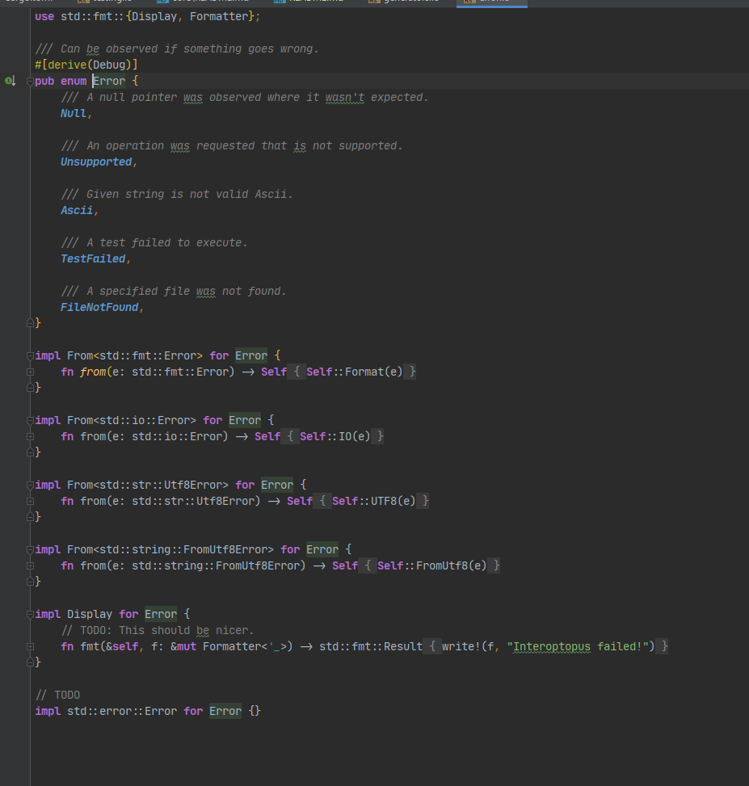
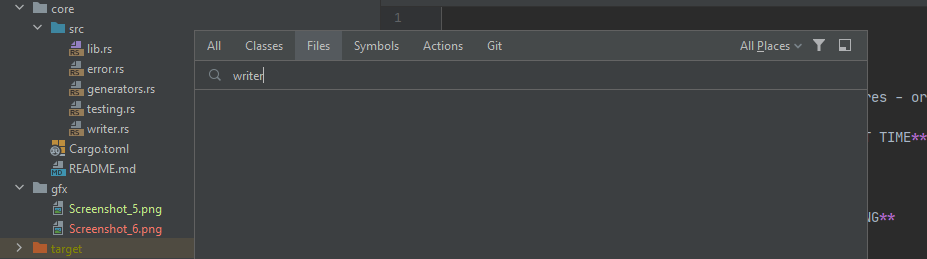

# How to reproduce

- Run latest IntelliJ Rust + all "Experimental Features - org.rust" enabled 
- Open repo in CLion
- Test "Go to file ...": **THINGS WILL WORK THE FIRST TIME**
- Close CLion.
- Open repo in CLion again
- Observe long time "Preparing resolve data ..."
- Try "Go to file ..." again: **THINGS STOPPED WORKING**

# Issues in this repo:

### Syntax Highlight Broken

Observe syntax highlighting stopped mid way through:

### "Go to file" not finding files

Observe file not found despite being there:

